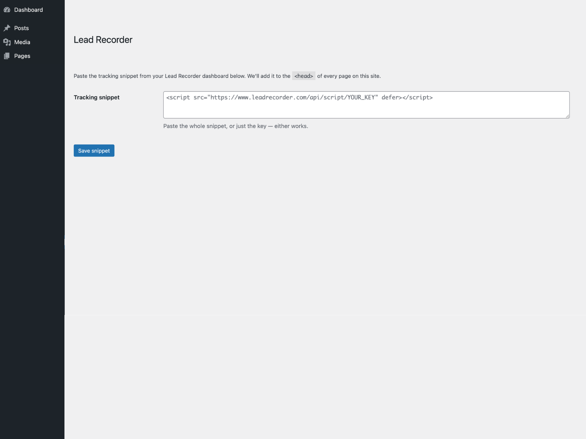

# Lead Recorder for WordPress

Adds your Lead Recorder tracking snippet to every page on your WordPress site. No theme edits, no tag manager.

[Lead Recorder](https://www.leadrecorder.com) shows you where every lead came from. It matches each phone click, form submission and booking to the ad, search or post that produced it.



## What it does

Once you paste in your tracking key, the plugin prints a single script tag in `wp_head` on every page view. That's it. The tracking itself happens in Lead Recorder.

The plugin stores only the tracking key from your snippet and builds the script tag itself. It never renders raw pasted markup back onto your site.

## Install

**From WordPress.org** (once published): Plugins → Add New → search "Lead Recorder" → Install → Activate.

**From this repo:** download the latest release zip, then Plugins → Add New → Upload Plugin.

**Manually:** clone into `wp-content/plugins/` and activate.

```bash
cd wp-content/plugins
git clone https://github.com/leadrecorder/lead-recorder-wordpress.git lead-recorder
```

## Setup

1. Copy your tracking snippet from your [Lead Recorder dashboard](https://www.leadrecorder.com)
2. In WordPress, go to **Settings → Lead Recorder**
3. Paste it in and save

Leads appear in your dashboard as they come in. You don't need a paid plan, the free tier works.

## Requirements

- WordPress 5.8 or later
- PHP 7.4 or later
- A Lead Recorder account ([free forever plan available](https://www.leadrecorder.com/pricing))

## What gets sent

The script loads from `www.leadrecorder.com` and sends page views and lead events (form submissions, phone clicks, booking-link clicks) to Lead Recorder so they show in your dashboard.

Nothing is sent until an admin enters a tracking key. Without one, the plugin prints nothing.

No cookies are used, so there's no consent banner requirement.

See the [privacy policy](https://www.leadrecorder.com/privacy) and [terms](https://www.leadrecorder.com/terms).

## Contributing

Issues and pull requests welcome. If you've found a bug, include your WordPress version, PHP version and the theme or page builder you're using.

For product support rather than plugin bugs, email hello@leadrecorder.com.

## Licence

GPLv2 or later. See [LICENSE](LICENSE).

---

Built by [Tom Galland](https://www.linkedin.com/in/tom-galland) in Sydney.
